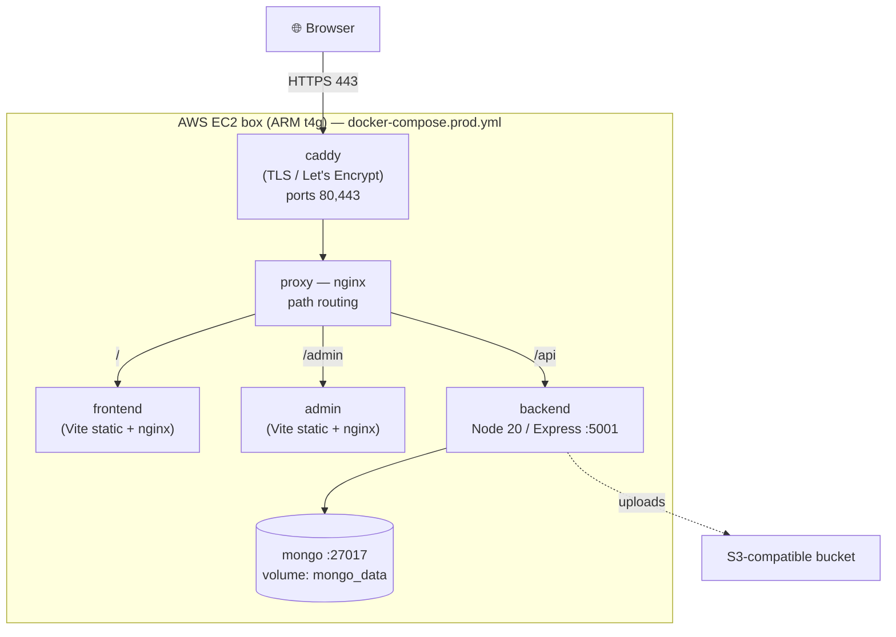

# kehilapp-devops — infrastructure, deployment & runbooks

**English + עברית.** This repo is the "operations" layer for kehilapp: how the
app is packaged (Docker), where it runs (one small AWS box via Terraform), how
new code ships (GitHub Actions), and the step-by-step guides to run it all
(runbooks). The three app repos (backend + two frontends) stay clean of ops.

> הריפו הזה הוא **שכבת התפעול** של kehilapp: איך האפליקציה נארזת (Docker), איפה
> היא רצה (שרת אחד קטן ב-AWS דרך Terraform), איך קוד חדש עולה לאוויר (GitHub
> Actions), ומדריכים צעד-אחר-צעד להפעלה (runbooks). קוד האפליקציה עצמו נשאר נקי.

---

## What is each piece, and WHY / מה כל חלק, ולמה

| Folder / file | English — what & why | עברית — מה ולמה |
|---|---|---|
| `docker/` + `docker-compose.yml` | **Package + run the whole app locally** with one command. Builds the backend + both frontends into images and wires them behind one nginx proxy. Why: identical setup on your laptop and the server = "works on my machine" stops being a problem. | אריזה והרצה של כל האפליקציה מקומית בפקודה אחת. |
| `docker-compose.prod.yml` | **The server version** — it *pulls* pre-built images (from GHCR) instead of building, and adds Caddy for automatic HTTPS. Why: the server stays dumb and fast — pull image, restart. | גרסת השרת — מושכת images מוכנים ומוסיפה Caddy ל-HTTPS אוטומטי. |
| `.env.example` | Template for the **one secrets/config file** the stack reads. Copy to `.env` (never committed). | תבנית לקובץ הסודות היחיד. |
| `terraform/` | **Creates the AWS server** (one EC2 box + firewall + fixed IP + SSH key) as code. Why: reproducible, reviewable, and `terraform destroy` stops the bill instantly. | יוצר את שרת ה-AWS כקוד. |
| `.github/workflows/deploy.yml` | **CI/CD** — on every push it tests the backend, builds a Docker image, and SSHes in to deploy. Why: no manual, error-prone deploys. | בונה, בודק ומעלה לאוויר אוטומטית. |
| `runbooks/` | **Exact command guides** for setup, deploy, rollback, logs, SSL, SSH. Why: 2am incidents shouldn't need improvisation. | מדריכי פקודות מדויקים. |
| `COST-ESTIMATE.md` | Detailed monthly $ for dev + prod. | הערכת עלות חודשית. |

The Docker files themselves are already written and heavily commented — read
`docker/backend.Dockerfile`, `docker/nginx/reverse-proxy.conf`,
`docker/nginx/spa.nginx.conf`, and `docker/caddy/Caddyfile` for the details.

---

## Architecture / ארכיטקטורה

One server. Everything is a container on a private docker network. Only Caddy
faces the internet (80/443). Mongo and the backend are **never** exposed
directly.



Plain-text version of the routing (from `reverse-proxy.conf`):

```
https://your-domain/         -> frontend  (public site)
https://your-domain/admin    -> admin     (admin panel)
https://your-domain/api/...  -> backend   (Express API on :5001)
https://your-domain/healthz  -> backend   liveness  (is the process up?)
https://your-domain/readyz   -> backend   readiness (is Mongo connected?)
```

Locally the same routing runs behind a plain nginx proxy on
**http://localhost:8080** (no Caddy, no HTTPS).

---

## Zero → running / מאפס להרצה

### A) Local (your machine) — fastest way to see it

```bash
# from the kehilapp-devops folder, with the sibling app repos checked out next to it:
#   ../kehilapp-backend-hardened
#   ../kehilapp-front-hardened
#   ../kehilapp-admin-hardened
cp .env.example .env          # set JWT_SECRET at least (openssl rand -hex 48)
docker compose up --build

# open:
#   http://localhost:8080            public site
#   http://localhost:8080/admin      admin panel
#   http://localhost:8080/api/healthz  -> {"status":"ok"}
```

### B) Dev on AWS

```bash
# 1. one-time prerequisites
aws configure                                   # AWS creds (kept out of git)
ssh-keygen -t ed25519 -f ~/.ssh/kehilapp        # your SSH key

# 2. create the server
cd terraform
terraform init
terraform workspace new dev                     # first time only
cp dev.tfvars.example dev.tfvars                # edit your IP (/32) + repo_url
terraform apply -var-file="dev.tfvars"
terraform output ssh_command                    # how to log in

# 3. first-boot setup on the box  → runbooks/01-initial-server-setup.md
#    (add /opt/kehilapp/.env, then docker compose ... up -d)

# 4. from now on: push to the `develop` branch → CI auto-deploys dev
```

### C) Prod on AWS

```bash
cd terraform
terraform workspace new prod                    # first time only
terraform workspace select prod
cp prod.tfvars.example prod.tfvars              # set your IP + real domain
terraform apply -var-file="prod.tfvars"

# point DNS A-record at:  terraform output public_ip
# first-boot setup:       runbooks/01-initial-server-setup.md
# HTTPS is automatic via Caddy once DNS resolves → runbooks/05-ssl-with-caddy-or-certbot.md
# from now on: push to `main` → CI auto-deploys prod
```

**Order of the runbooks:** `01` setup → `02` deploy → `03` rollback (if needed)
→ `04` logs/monitoring → `05` SSL → `06` SSH.

---

## File tree / עץ קבצים

```
kehilapp-devops/
├── README.md                     ← you are here
├── COST-ESTIMATE.md              monthly $ for dev + prod
├── .env.example                  the one secrets file (copy to .env)
├── docker-compose.yml            LOCAL: build + run everything
├── docker-compose.prod.yml       SERVER: pull images + Caddy HTTPS
├── docker/
│   ├── backend.Dockerfile        Node 20 backend image (multi-stage)
│   ├── frontend.Dockerfile       Vite public site → static nginx
│   ├── admin.Dockerfile          Vite admin panel → static nginx
│   ├── .dockerignore.example
│   ├── nginx/
│   │   ├── reverse-proxy.conf     path routing (/,/admin,/api)
│   │   └── spa.nginx.conf         SPA fallback for the static sites
│   └── caddy/
│       └── Caddyfile              auto-HTTPS front door (prod)
├── terraform/
│   ├── providers.tf              AWS provider, pinned version
│   ├── variables.tf              all the knobs + cost tradeoffs
│   ├── main.tf                   EC2 + security group + Elastic IP + key
│   ├── outputs.tf                public_ip, ssh_command, site_url
│   ├── userdata.tpl              first-boot: install Docker, clone repo
│   ├── dev.tfvars.example        copy → dev.tfvars
│   ├── prod.tfvars.example       copy → prod.tfvars
│   ├── backend.tf.example        optional S3+DynamoDB remote state
│   ├── README.md                 terraform-specific guide
│   └── .gitignore                keeps *.tfvars / state out of git
├── .github/workflows/
│   └── deploy.yml                test → build image → SSH deploy (dev/prod)
└── runbooks/
    ├── 01-initial-server-setup.md
    ├── 02-deploy.md
    ├── 03-rollback.md
    ├── 04-logs-and-monitoring.md
    ├── 05-ssl-with-caddy-or-certbot.md
    └── 06-ssh-access.md
```

---

## Golden rules / כללי זהב

- **Never commit secrets.** Only `*.example` files. `.env`, `*.tfvars`, and
  terraform state are git-ignored.
- **ARM everywhere.** `t4g.*` Graviton is ~20% cheaper and fully supported.
- **One public door.** Only Caddy (80/443) is exposed; Mongo/backend stay
  private on the docker network.
- **`terraform destroy` stops the bill.** Tear down dev when you're not using it.
